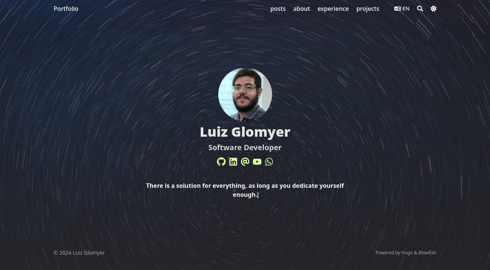

# luizglomyer.github.io

[](https://luizglomyer.github.io)

My personal website, a place for showing some of my projects and skills, to talk about technology, to share my thoughts and to sometimes ramble about random stuff.

 Built with [Hugo](https://gohugo.io/) and [Blowfish](https://blowfish.page/). It uses Github Pages as the hosting service, the website is deployed everytime a new commit gets into the main branch, thanks to Github Actions. You can access the site here: https://luizglomyer.github.io


## Getting Started

To build the static files for the website, run the following command:
```bash
hugo
```

To run a development server, use the following command: 

```bash
hugo server --watch --bind=0.0.0.0 --baseURL=http://0.0.0.0:1313 --buildDrafts --disableFastRender
```
- `--watch` to watch for file changes
- `--bind=0.0.0.0` `--baseURL=http://0.0.0.0:1313` to expose the server in the network.
- `--buildDrafts` to show articles even if they are marked as a draft.
- `--disableFastRender` for full rebuilds on file changes

## Blowfish configurations

The Blowfish theme has come configurations that are defined in the .toml files. There is a CLI tool that helps with that. Install and run blowfish-tools using:
```bash
npx blowfish-tools

blowfish-tools
```

## Credits

Background image: https://unsplash.com/photos/blue-and-white-light-illustration-3NvRkNaiHtc
