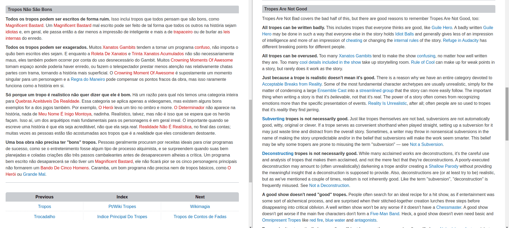

I'm self-taught in English and I've been asked a lot about how I learned the language and got to the level I'm at today. 

<h2>Simple answer: play video games!</h2>
<h2>Real answer: there are no simple solutions to complex problems.</h2>

When it comes to the English language, I think everyone should learn and master it. Nowadays, English is universal and pervasive, and it's practically impossible not to come into contact with it in some way. Our own culture is already a mixture of national and international content, from the music we listen to to the films and series we watch (which often don't even translate the title into our language!).

 >Please note: This post was originally written about my learning of the English language. I decided to reverse the order of the words in Portuguese and English to make the text clear.

## How I learned

I'll summarize how I learned English:

>Note: I'm far from being a language expert, this is just a personal account of how I perceive language learning, including some patterns and tricks I've noticed over time. When in doubt, ***take it with a grain of salt!***

When I was about 10 years old, I liked to play games on my cell phone. Back then, cell phones were much more rustic and games were often very simplified due to their low processing power. The **J2ME** technology reigned, games based on Java. All you needed was a `.jar` file and any cell phone could run it. Browsing websites that made these `.jar` files available, I came across a game with a funny name and jokes, [Fênix Veríssimo](https://advogados-de-primeira.fandom.com/pt-br/wiki/Advogados_de_Primeira:_F%C3%AAnix_Ver%C3%ADssimo), a game in which you play the role of a lawyer and have to defend your client in court. It caught my attention because it was **entirely in Portuguese**, a rarity at the time.

>This must already be _lost media_
>

The story had you hooked and the gameplay was strangely engaging. However, the game only had the first chapter and it was as short as a half-hour tutorial. I wanted more, but there wasn't any more, so I replayed this little prologue several times and let it go. A few years later, fate presented me with a game called [Phoenix Wright: Ace Attorney](https://wikipedia.org/wiki/Ace_Attorney), it was the same Ace Attorney I knew, but with one small detail: the game was **entirely in English**! Despite this, I wanted to play it anyway, even if I didn't understand everything. And here begins the great insight into how to learn English.

### Context analysis

When I was 12, I only knew the **basic of the basic**. _Vermelho_ is red, _casa_ is house and various other words that everyone should know in one way or another. It was a knowledge based purely on nouns, I didn't even know verbs. So as well as needing to learn vocabulary (the words of the language), I also had to learn grammar (the rules that govern that language). At that time it wasn't so easy to translate text, Google Translate was still very crude and its translations were often far from the real meaning. How do you learn in such a scenario? By analyzing the **context**. Look at the following sentence (`example 1`):

> A casa vermelha é grande e simples.

It's an easy sentence because it uses very common words. But let's say you only knew that _vermelha_ was red and that _casa_ was house. With this information alone, you can extract the fact that the sentence is about a house that is red. You can also absorb, deduce or infer the missing information: _simples_ looks like the word simple, so it's possible to assume that it's correct to translate it this way and take that as the basis for my understanding of the sentence. And from the context we can go further: if this phrase appears in a comic book, for example, we have a visual reference together with the text to support us, so we can see that it's a bigger house than usual and, because of the way it was drawn, simple and ordinary. From this, I can deduce that _grande_ perhaps means “to be big”, thus learning a new word. The translation of the phrase is:

> The red house is big and simple.

Now a slightly more complex sentence (`example 2`):

> Então, quando me aproximei, eu percebi que havia um pouco de sangue seco na estátua.

For a beginner, this sentence is difficult. The complexity is due to its size and structure. However, if we analyze the context in which we are inserted, an investigative game whose objective is to find the real murderer of a crime and which takes place in a court, we can understand the meaning of the message easily. Just like the previous example, we can separate the main words of this sentence into “**cores**” that define the main information. In my opinion, there are 2 to 4 words that form the core of this sentence. They are, in order of importance:
- _sangue_ (blood)
- _estátua_ (statue)
- _seco_ (dry)
- _eu_ (I)

We human beings use language to communicate the ideas in our heads. The words we express delimit the idea we are trying to convey. The point is that we don't need to know the meaning of every word to understand the message, we just need to know the context and delimit it according to our current knowledge of the words used. If I only know _sangue_, I know that it's about blood. But just knowing that it's about blood opens up countless different possibilities, so more words are needed. In the following table I compare the number of known words and the possible meanings we can extract from `example 2`.

| Known words | Inferred meaning |
|----------|----------------------|
|_sangue_|There is blood. Occurrence of blood.|
|_sangue_ + _estátua_|Blood on the statue. Blood from the statue (as if it were bleeding or as if the blood were one of its own characteristics). Blood-colored statue.|
|_sangue_ + _estátua_ + _seco_|Dry blood on the statue. Blood-colored dry statue.|
|_sangue_ + _estátua_ + _seco_ + _eu_|I [something] dry blood on the statue|

As more words are known, the context is defined and the real meaning of the sentence becomes more apparent. In this process, we analyze and discard possibilities that do not seem to match reality. Using common sense, if I only know the first 3 words, it is very unlikely that I will think that the sentence is about "dried blood of the (bled by) the statue", because in most situations this interpretation does not make sense. It may even make sense if we are talking about a fantasy book, but most of the time a sentence like this will not make sense and will be false. All understanding is based on the context in which we are inserted, and if we have references beyond the text itself, even better. If `example 2` were accompanied by the following image, there would be no doubt as to the meaning of the sentence.

I would say that these cores are usually nouns or verbs. The remaining words are not so important to understand the general meaning of the sentence and, at this point, for the beginner, they can be ignored. The idea is to go up one step at a time, first learning the cores of the message (meaning and translation) and then the words that complement them, such as prepositions and adverbs. Finally, the translation of the sentence:

> So, as I came closer, I noticed that it had some dry blood on the statue.

---

### Learning Techniques

Deduction and inference are two techniques that I often use in my learning. There is a subtle difference between these two words.

#### Deduction

A **deduction** takes you to a single, unambiguous point. In `example 1`, if I know the meaning of all the words except the word _grande_, and if I also know the translation of the sentence, it is possible to easily deduce what the translation of this word is.

> The red house is big and simple.

| Word | Known translation |
|----------|----------------------|
|A|The|
|vermelha|red|
|casa|house|
|é|is|
|grande|???|
|e|and|
|simples|simple|

We can deduce that _grande_ means large. This phenomenon of knowing the meaning of the entire sentence but not knowing one or two words happens relatively frequently and is a routine to which we must adapt. Deduction solves this problem by analyzing the context and also teaches you a new word.

#### Inference

An **inference** is more probabilistic. In general, it is not possible or ideal to deduce a new meaning at first because the meaning we discover may only be valid for that context and may be different in another. Let's analyze the use of the word _ponto_.

> Ela tem um ponto

The translation is "She has a point", meaning "She is right about this/She has reason". This phrase is often used in contexts where people are arguing. If we deduce that _ponto_ exclusively means "to have reason" we will have problems in other contexts:

> O tenista marcou um ponto

The translation is "The tennis player scored a point". If we base ourselves purely on mistaken deduction, we could understand something like "The tennis player scored a reason", which makes no sense at all. This is because there are words that change meaning depending on how they are inserted in the sentence. Inference then provides a general idea of ​​that specific meaning in that specific context, it is a slightly more restricted generalization since the discovered meaning may or may not be applicable to another case.

The inference technique is based on the analysis of patterns and similarities between different cases. It involves trying to absorb the feeling that the word brings in that specific context. This is important because the words we know can have new meanings depending on their placement. For example, look at how many meanings there are for the word _ponto_:

<iframe 
  src="https://www.wordreference.com/enpt/ponto" 
  width="100%" 
  height="600px"
>
</iframe>

Moving a little to the computational side, I would say that the inference technique is a kind of "machine learning" for us. The more we read, the more examples we will have of how words behave in different situations and the more accurate our inferences will be.

")

Even so-called **false cognates**, words with similar spellings but different meanings in multiple languages, are not as bad as they seem. Because they have the same grammatical class, their mistaken meanings sound natural in a sentence, and many of them have meanings that are quite close to the real thing. As long as the student learns the real translation over time, false friends are not that harmful, after all:

- **colégio** is not that different from facuuldade (**_college_**)
- **livraria** is not that different from biblioteca (**_library_**)
- **parentes** is not that different from pais (**_parents_**)

## Exposure to the language

It all depends on how much you expose yourself to the language you want to learn. Studying for a fixed period of time during the day and stopping right there is usually not effective. We should try to expose ourselves and absorb as much content in the foreign language as possible. Start watching series and movies with English subtitles, start paying attention to song lyrics, start reading books in their original language. This is really creating a new habit.

The ideal is to combine business with pleasure and focus on the things that you like best. There is no point in reading a book in English if you read it just to learn and have no genuine interest in it, otherwise your learning experience will become boring and you will get frustrated. Look for things that are interesting and fun for you.

In my opinion, the best media for learning English are those that are "still", that is, in which the words can be read naturally and calmly. This list includes comics, books, most video games and even websites on the internet. On the other hand, music, movies and TV shows are more difficult to understand because they are media that are played "in real time", meaning you have to actively pause the material, thus interrupting the flow of an action scene, for example, which makes the experience quite tiring.

Immersion is the way in which children usually learn their native languages. But unlike them, adults do not have the same neuroplasticity, or ability to mold the brain, so it takes us much longer to learn new skills. If we have constant exposure to the language, our brain will interpret it as being common to its environment. Each contact with the English language should be seen as a new learning opportunity.

### Scarce content in our language

Many people learn out of sheer necessity. Just like in my case with the game Ace Attorney, many times a material has no translation or is only available in English, a fact that tends to be extremely common with niche material (cult films, obscure animes, scientific articles...). This forces you to leave your comfort zone and not necessarily learn, but understand what is expressed in the work; learning the language ends up being the consequence of your effort.

Great sources of information on the internet exist only in English, or when there are translations, they tend to be scarce. The website [TV Tropes](https://tvtropes.org/) is a perfect example of this, the site is a gold mine of analysis of works of pop culture, but only a tiny fraction of all its pages are translated into Portuguese. Let's compare the content of the two versions:

The article in Portuguese has less content compared to the one in English, the overall size of the article is smaller, there are missing paragraphs (perhaps because it is out of date) and many of its links point to pages that do not exist. This is one of the major problems of finding content in our native languages, regardless of the country. It is easier to centralize an entire knowledge base in a single language (English) than to translate this entire base multiple times into each of the languages ​​that exist on our planet, otherwise it would be a task that would require significant effort.

## Common pitfalls

Certain things hinder your learning more than they help.

**Learning multiple languages**: be careful about where you focus your energy. Some people get excited and try to learn two or three languages ​​at the same time, and this usually backfires; eventually the excitement wears off and the real difficulty appears, resulting in people giving up. We should also analyze the true need to learn a new language. I say this because I see cases of multilingual people who learn 3, 4, 5 different languages ​​but in the end do not really benefit from them. It is learning without a focus on practical use. If the languages ​​are not used constantly or routinely in someone's life, the time invested may not be worth it.

**Translating in your head**: When you are a beginner, it may seem natural to take an English sentence and translate it into Portuguese. However, this is not ideal. Here's why:

- Portuguese speaker: Portuguese sentence -> understanding
- English speaker: English sentence -> understanding
- Portuguese speaker: English sentence -> Portuguese sentence -> understanding

An extra step has been added to our understanding process. This means that if we translate English sentences into our language, we will be making a certain additional cognitive effort, making our understanding slower. To combat this, we must learn to **extract and absorb the meaning** of things in the English language. For example, if I read the word _bola_, the ideal is to automatically understand in the reading process that it is a ball, without even thinking about the translation of the word. This is something a little more advanced but essential for **fluency**, after all, the translation acts as an obstacle to automatic understanding. One way to adapt the brain is to start thinking in English, to have thoughts that are not in our language.

**Learning from songs**: This is risky for a beginner because song lyrics often use figures of speech such as metaphors, metonyms and personifications, making unambiguous translations and understanding difficult. At the beginning of our journey we need a solid vocabulary base, acquiring vocabulary where figurative language reigns can cause confusion.

### Duolingo

")

Duolingo, although an extremely well-made app, is a huge trap.

First, I will talk about its positive points. Duolingo is undoubtedly an excellent way to democratize the teaching of foreign languages. With an intuitive interface, pleasant visuals and sound effects, it captures our attention without much effort. The great thing about this app is its **gamification**, the learning process becomes a game that rewards the player for each correct answer and lesson learned with experience points, which are responsible for forming a weekly ranking. Learning new words and advancing in level becomes fun.

The big problem with Duolingo is its **lack of effectiveness**. Each lesson focuses on learning about 5 words in approximately 5 minutes. Different applications of these words are shown and you must form sentences correctly with them, and then again, as a fixation. Then, the gamification requires you to redo the same lesson about 5 times to make it complete. Here we have a case of excessive **repeatability**, you must do the lesson even if you know half of the words, just to mark it as complete. Unlike a spaced repetition method, you are unable to indicate which words you have already mastered.

Another problem is the **simplicity** of its lessons. To make learning fun, the user must feel that they are progressing, and for this to happen, the sentences must be easy, resulting in sentences with poor grammatical structures. If the lessons were difficult, the user would probably get frustrated with frequent mistakes and would uninstall the application, so they are never properly challenged or even taken out of their comfort zone. Take a look at this lesson about food, it boils down to learning assorted words and their combinations in sentences that do not even exceed 4 words, some with only two. Minimalist learning?



Something that happens frequently is a **change of focus**: many people start using the app as a game/pastime and forget about its real objective, which is to learn a new language. The concept of daily goals makes it seem like we have a certain obligation that, once fulfilled, frees us from learning the language until the next day. The offensives require daily effort from the user, who is penalized if they stop using the app for a day. This way, a _loop_ occurs: the user does little and shallow practice with the lessons, feels excused from learning for the rest of the day and comes back the next day, absorbing the same tiny amount of information. There are also users who dedicate themselves to staying at the top of the weekly rankings, doing _grind_ of easier lessons to get a score faster.

In the long run, this app becomes a huge waste of time. On its own, it is incapable of bringing someone to fluency due to its shallow methodology. It is much more beneficial to learn from something closer to reality than to suffer from the illusion of learning that gamification brings with it.

## Conclusion

The effort to learn English is entirely up to you. It is not an easy journey. Stick to the basics and gradually improve. In general, I recommend acquiring your skills in this order of importance:

1. learn to read (vocabulary, recognize patterns)
2. learn to write (fix the patterns)
3. learn to listen
4. learn to speak

Always alongside a real-world application of the language, such as a book or a series. There are details that you will only pick up on by seeing things in practice, such as regional accents and puns. I personally consider the fact that you know puns to be a good metric to define whether you have a good level of English, they demonstrate your comprehensive understanding of the language. And if you can understand phonetic puns, you are certainly advanced.

")
