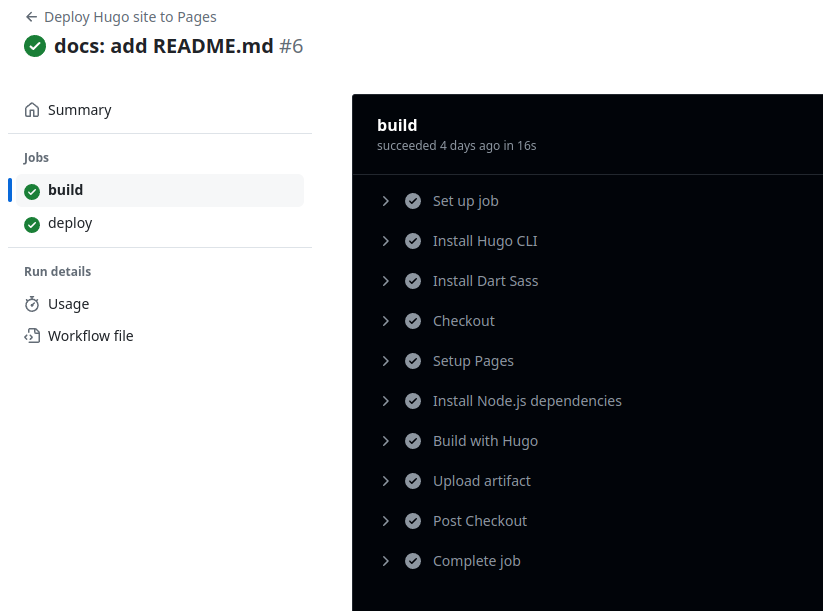
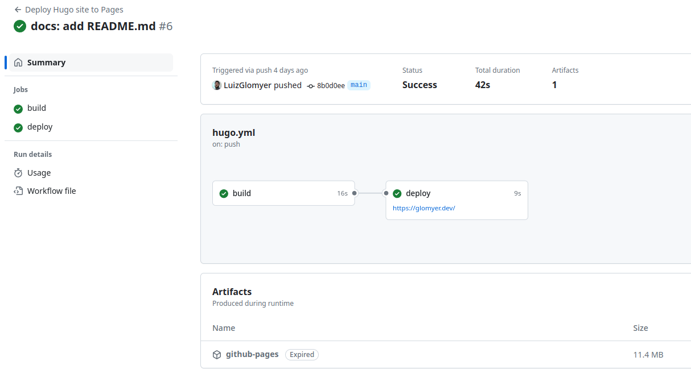

I decided to update my personal website/portfolio. I made the [old one](/legacy) a few years ago and, looking at it today, I see that it could be a bit cleaner and more organized. 

At first, I thought about making another one from scratch using some framework, such as React, but in the end I decided to research SSGs and tinker with something new. SSGs are the so-called *Static Site Generators*, tools that generate the pages of a website from common text files, such as Markdown (.md). This generates tremendous efficiency, as you only need to use the standard Markdown syntax to assemble the content. For example, you can easily embed code due to its native support:

>Python 

```python
for i in range (10):
  pass
```

This makes the focus become the writing of the content itself, rather than how to display it on screen. Agility is always welcome.

Of the various alternatives, I decided to use [Hugo](https://gohugo.io/). Jekyll and Gastby have some limitations that are covered by Hugo, whose main focus is on organizing the site's content. After browsing the various themes available, I found [Blowfish](https://blowfish.page/), loved the layout and decided to go with it. 

After spending some time learning the basics of the stack and configuring it, creating content becomes extremely easy, all you have to do is add .md files and have Hugo compile the site. Using CI/CD via Github Actions, each commit made to the repository generates a build of the site that is deployed to Github Pages in a very transparent process. The whole process is automated.






The source code for this site is available on Github:


