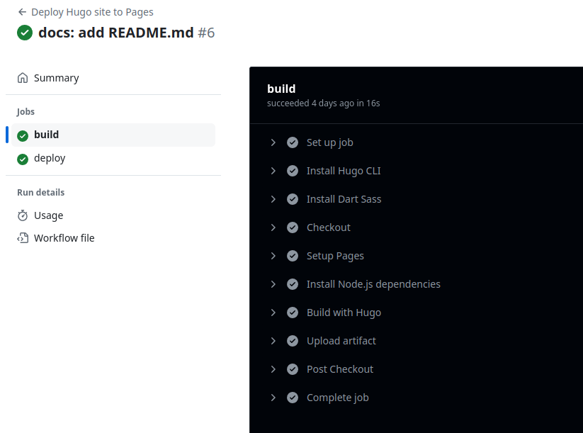

Decidi dar uma atualizada no meu site pessoal/portfólio. O [antigo](/legacy) fiz alguns anos atrás e, observando hoje, vejo que poderia ser um pouco mais limpo e organizado. 

De início, pensei em fazer outro do zero usando algum framework, como React, mas por fim optei pesquisar sobre SSGs e mexer com algo novo. SSGs são os chamados *Static Site Generators*, ferramentas que geram as páginas de um website a partir de arquivos de texto comuns, tal como o Markdown (.md). Isso gera uma eficiência tremenda, pois basta usar a sintaxe padrão do Markdown para montar o conteúdo. Por exemplo, é possível embutir código facilmente devido ao seu suporte nativo:

>Python 

```python
for i in range (10):
  pass
```

Isto faz com que o foco se torne a escrita do conteúdo em si, ao invés de como mostrá-lo em tela. Agilidade sempre é bem vinda. 

Dentre as várias alternativas, decidi em usar o [Hugo](https://gohugo.io/). Jekyll e Gastby possuem algumas limitações que são cobertas pelo Hugo, cujo grande foco jaz na organização do conteúdo do site. Após navegar entre os vários temas disponíveis, encontrei o [Blowfish](https://blowfish.page/), adorei o layout e a escolha foi concretizada. 

Após um tempo dedicado a aprender as bases da stack e configurá-la, a criação de conteúdo se torna extremamente fácil, bastando colocar arquivos .md e mandar o Hugo compilar o site. Usando CI/CD por meio do Github Actions, cada commit feito no repositório gera uma build do site que é implantada no Github Pages num processo bastante transparente. Todo o processo é automatizado.




O código fonte deste site está disponível no Github:


