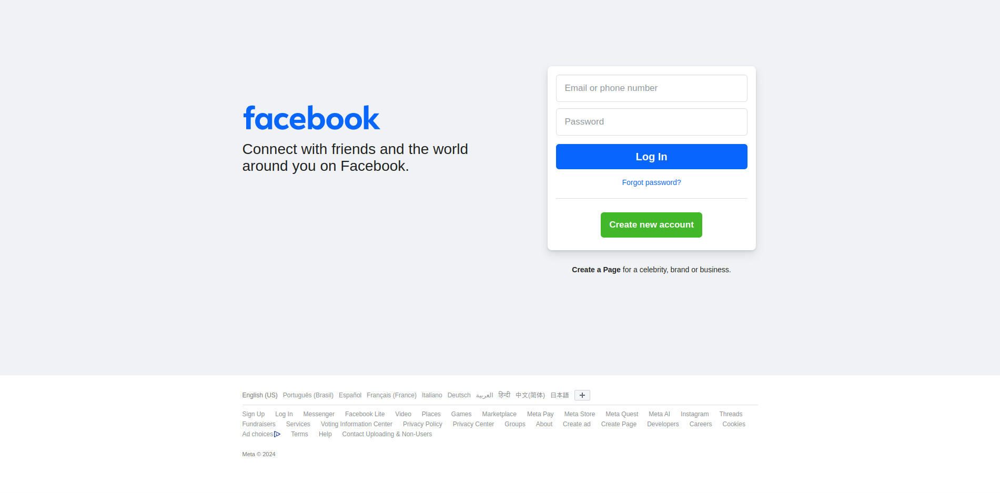
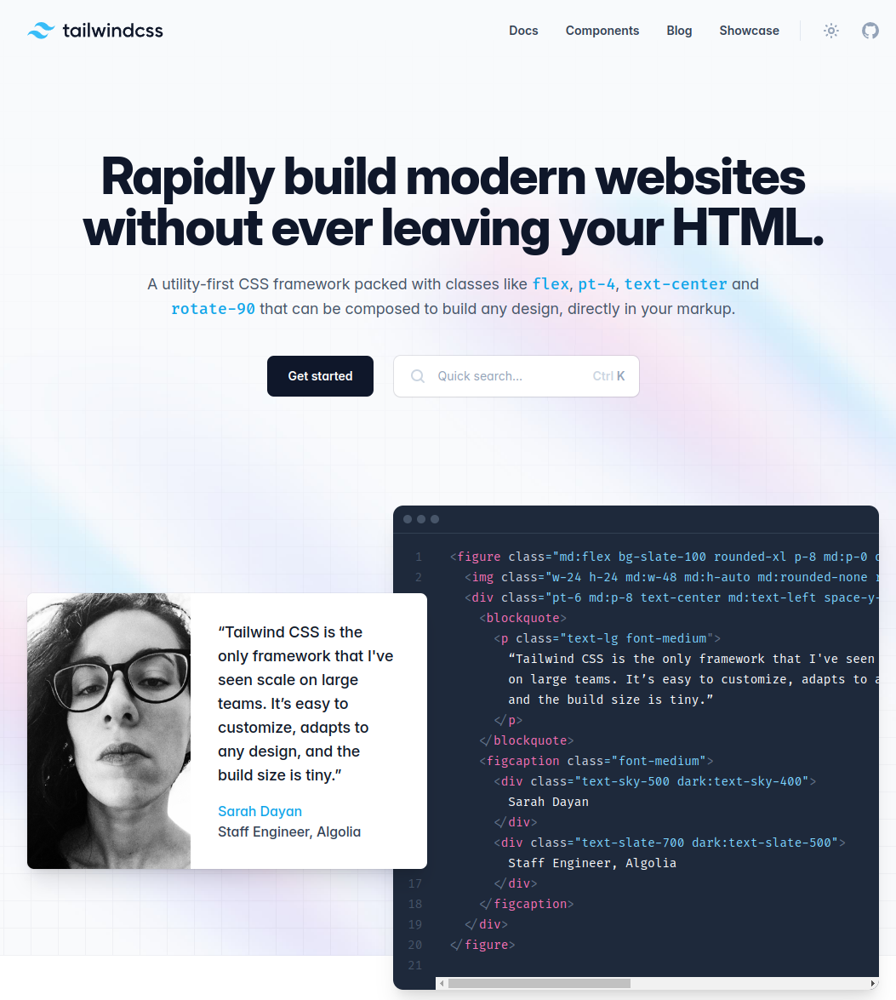

## Animações SVG

Quando entrei pela primeira vez na landing page do tema [Blowfish](https://blowfish.page/) fiquei maravilhado com um detalhe do site: o background. Infelizmente o bg não vem com o tema padrão, mas isso atiçou minha curiosidade e eu fui atrás para saber como uma animação tão fluída poderia ser um background. Foi quando eu achei o site pessoal do criador do Blowfish e dando uma espiada em seu repositório que descobri o segredo da mágica: um arquivo .svg animado.

<iframe 
  src="https://blowfish.page/" 
  width="500px" 
  height="480px"
>
</iframe>

Eu não tinha ideia de que um SVG podia conter animações. Isto abriu minha mente: grande parte das animações "nativas" que vemos em websites e em componentes utiliza este formato por debaixo dos panos. Desta forma, consegue-se obter uma qualidade ótima pois estas animações não usam imagens raster, e sim são renderizadas diretamente no navegador a partir de cálculos matemáticos vetoriais.

## Animações e interfaces gráficas

Uma coisa que observo, tanto como profissional quanto como usuário, é que as páginas da web que possuem animação conseguem reter uma quantidade maior de usuários em relação àquelas que são totalmente estáticas. Entrar numa landing page e se deparar com uma animação de dar brilho nos olhos pode ser o fator decisivo de se usar ou não um sistema. O poder de uma interface gráfica bem planejada não deve ser menosprezada, e animações, não só as baseadas em SVG, são um grande, um enorme bônus na captação de interesse. Compare, por exemplo, as homepages do Facebook, um dos sites mais acessados do mundo, e do Tailwind CSS.




O Facebook, apesar de ser uma das maiores redes sociais da atualidade, prefere manter um visual mais minimalista e com cores neutras. A homepage do Tailwind CSS, por sua vez, chama atenção pela sua dinamicidade: é mostrado um código em tela para um componente, que é renderizado ao lado. Atributos são modificados e a visualização do componente é alterada em tempo real, em transições suaves. Isto não só cativa, como também mostra de maneira prática as capacidades técnicas do framework, causando uma forte impressão.

Ao meu ver, a maioria das as interfaces gráficas que vemos, ou mesmo que desenvolvemos, carecem deste *eye candy* que são as animações. Uma startup que utilize a abordagem do Facebook raramente fará sucesso, pois é uma identidade visual muito fraca. 


## 🔴🟢🔵 Venn RGB



Eu decidi então brincar um pouco de fazer animações SVG. Pensei em algo simples e visualmente aprazível, um diagrama de Venn com as cores RGB. Como a junção de três cores distintas pode gerar resultados interessantes, usei de `mix-blend-mode` para ver as diferentes misturas de cores possíveis. Um SVG funciona basicamente tal como um html, um arquivo em que se define tags para cada um dos elementos presentes na imagem. A grande diferença é a existência de tags específicas que, ao invés de definir elementos em tela, definem regras a serem aplicadas nestes elementos. Separei o markup da estilização para melhorar a legibilidade, mas na prática ambos estão no mesmo arquivo.

```html
<svg class="bg-rgb" width="400" height="400" xmlns="http://www.w3.org/2000/svg">
   <defs>
    <g id="R1">
      <ellipse rx="100" ry="100">
        <animateTransform attributeName="transform" type="rotate" dur="1s" from="0" to="360" repeatCount="indefinite" />
        <animate attributeName="cx" dur="20s" values="0; 150; 0" repeatCount="indefinite" />
      </ellipse>
    </g>
  </defs>

  <circle cx="200" cy="200" r="1.5" class="reference-point" />
  <g>
    <use href="#R1" transform="rotate(110 200 200) translate(250 250)" class="red ellipse" />
    <use href="#R1" transform="rotate(230 200 200) translate(250 250)" class="green ellipse" />
    <use href="#R1" transform="rotate(350 200 200) translate(250 250)" class="blue ellipse" />
  </g>
</svg>
```

A tag `<defs>` age como um template, definindo a estrutura base de elementos que podem ser reutilizados na animação por meio da tag `<use>`. No caso, a tag é utilizada para definir um círculo de raio 100 que possui duas animações: uma de deslocamento em vai e vem no eixo x e outra que aplica uma rotação neste deslocamento, resultando em uma movimentação em espiral. Cada um dos `<use>` cria um círculo diferente e aplica um override nos atributos que definem o estado inicial de cada um deles. Também são definidas classes CSS para cada um destes elementos, para aplicar estilizações específicas. Por fim, é desenhado um círculo bem no meio do SVG para termos a visualização do centro da animação.

```css
    .ellipse {
      mix-blend-mode: lighten;
    }

    g {
      isolation: isolate;
    }

    .red {
      fill: rgb(255, 0, 0);
    }

    .green {
      fill: rgb(0, 255, 0);
    }

    .blue {
      fill: rgb(0, 0, 255);
    }

    .reference-point {
      fill: black;
    }

    .bg-rgb {
      overflow: visible;
      isolation: isolate;
      background-color: #fff;
      background-image: linear-gradient(45deg,
          rgba(0, 0, 0, 0.1) 25%,
          transparent 25%,
          transparent 75%,
          rgba(0, 0, 0, 0.1) 75%,
          rgba(0, 0, 0, 0.1)),
        linear-gradient(45deg,
          rgba(0, 0, 0, 0.1) 25%,
          transparent 25%,
          transparent 75%,
          rgba(0, 0, 0, 0.1) 75%,
          rgba(0, 0, 0, 0.1));
      background-size: 20px 20px;
      background-position: 0 0, 10px 10px;
    }
```

O CSS é definido numa tag `<style>` que reside logo acima da tag `<defs>`. Primeiramente, é definido um background quadriculado por meio de gradientes. A mistura das cores acontece com o uso de **blend-modes**, foi escolhido o atributo *lighten* para fazer com que a soma de de cada uma das cores de juntem a cada interseção de círculos. Na prática, as três interseções de círculos significa que estamos realizando a seguinte soma, gerando a cor branca:


\\(rgb(255, 0, 0) + rgb(0, 255, 0) + rgb(0, 0, 255) = rgb(255, 255, 255)\\)

Por padrão, os círculos também aplicam blend no background, alterando suas cores padrão. Para evitar este comportamento, cada um dos `<use>` é envelopado numa tag de grupo `<g>` que possui em seu CSS o atributo `isolation: isolate`, restringindo o escopo do CSS, e por consequência, do blend.


---

## 🔵🟣🟡⚫ Venn CMYK



De modo bastante similar, e com algumas mudanças nos parâmetros, é possível adaptar o exemplo anterior para demonstrar o sistema de cores CMYK, se baseando no princípio da exclusão das cores via **blend-mode**.

Um detalhe interessante em ambas as animações é a definição de um `overflow: visible` para o background do SVG, fazendo com que os elementos da animação vazem para fora do elemento, que possui tamanho fixo de 400x400 px.

## 👁️ Hyperzone background

O background dessa postagem vem do jogo Kirby's Dream Land 3. Eu sempre tive a vontade de implementar este background, então aproveitei a deixa e me desafiei a recriá-lo puramente com animações .svg (sem Javascript!). Devo dizer que foi uma experiência desastrosa na qual eu aprendi uma boa lição: não tente reinventar a roda. Certas coisas não devem ser feitas do absoluto zero. 

O .svg tem resolução 500x500. Para criar um padrão infinito precisei fazer elipses auxiliares para proporcionar a ilusão de sair de um lado da tela e entrar pelo outro. Primeiramente, tive muito trabalho braçal para fazer cada translado de cada uma das elipses, precisando calcular cada coordenada de início e fim da animação. Além disso, tive inúmeros problemas de clipping, às vezes as elipses não se alinhavam com perfeição e a transição não era suave, precisei usar de muita tentativa e erro para dar certo. Nunca faça um negócio desses do zero, sério.

 O resultado final pode ser visto por completo [aqui](/hyperzone). O original:

<iframe width="560" height="315" src="https://www.youtube.com/embed/CngedZCAqqg?si=ThQiS4TaufKiUGAk&amp;start=620" title="YouTube video player" frameborder="0" allow="accelerometer; autoplay; clipboard-write; encrypted-media; gyroscope; picture-in-picture; web-share" referrerpolicy="strict-origin-when-cross-origin" allowfullscreen></iframe>


## Conclusão

Ao meu ver, programar SVGs manualmente não vale à pena. É um processo que demanda bastante tempo, além de não ser um processo fácil de se testar. Um SVG puro (sem a presença de javascript) costuma ser muito atrelado aos elementos declarados em seu markup, criando um artefato com elementos estático. Gerar elementos de maneira dinâmica, por exemplo, um círculo a cada 100px de viewport, não me parece possível, pois existe um sistema de coordenadas fixo. Uma forma de contornar isto é a utilização de patterns, mas isto depende do objetivo que se quer alcançar com o uso do SVG.

Tenho certeza de que devam existir formas mais convenientes e ágeis para a criação de animações, como softwares de design. Pesquisando, descobri um site chamado [loading.io](https://loading.io/) que permite a confecção de ícones e [padrões](https://loading.io/pattern/) animados. Bem útil para dar vida às nossas páginas.
