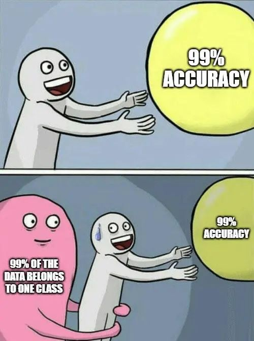
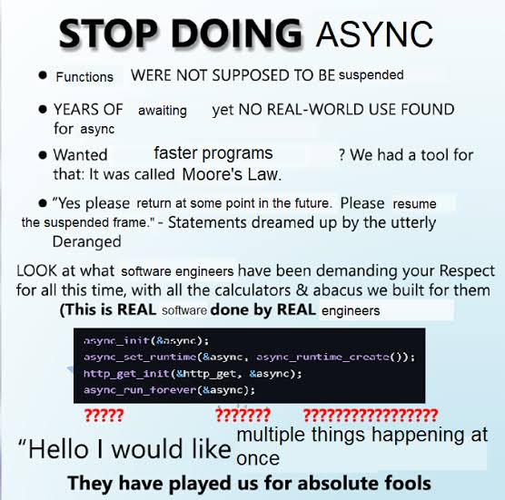
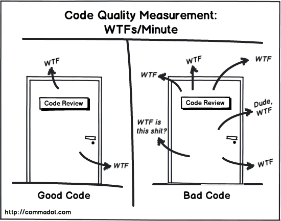
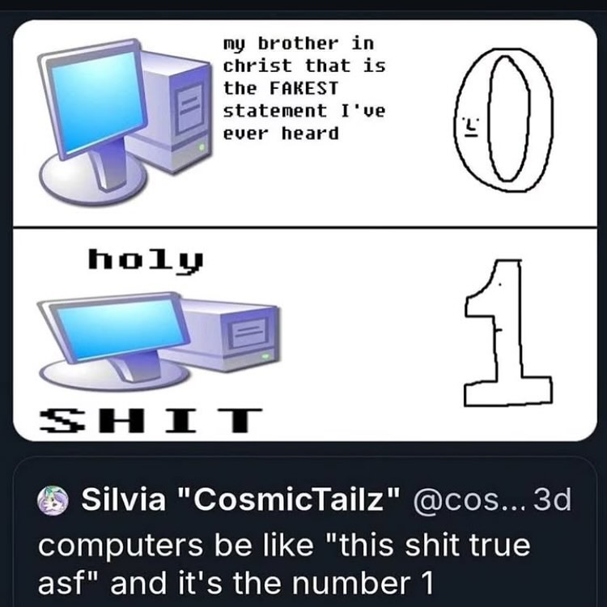
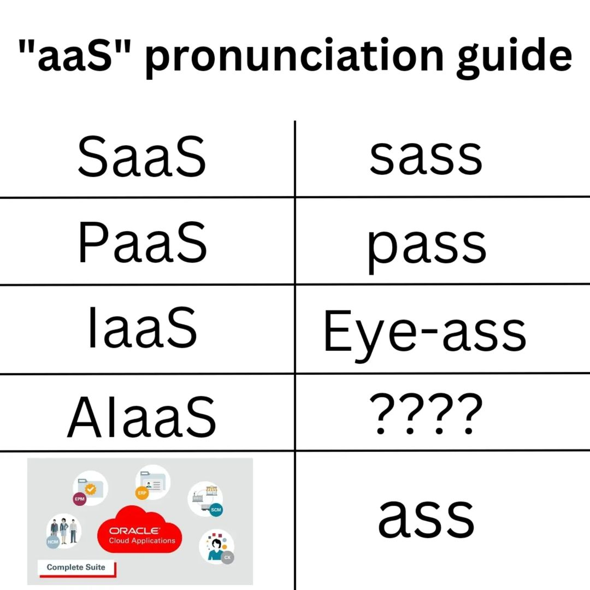
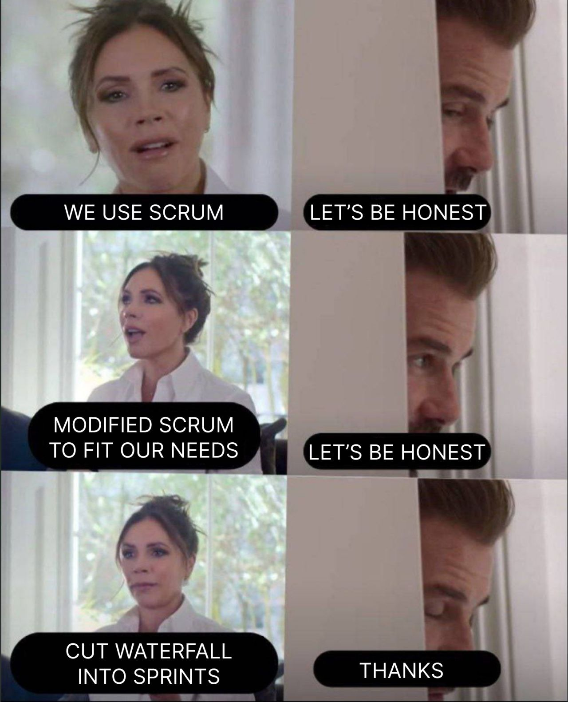
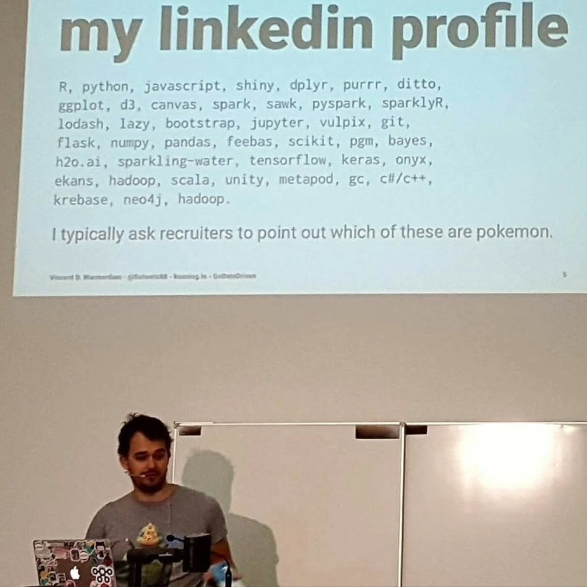
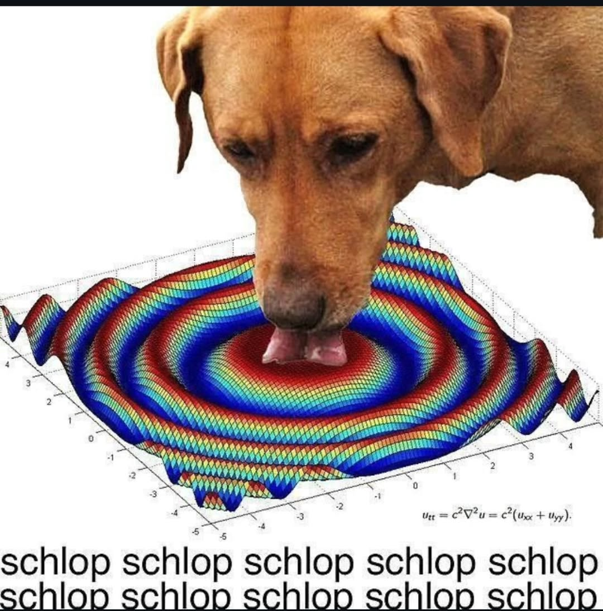
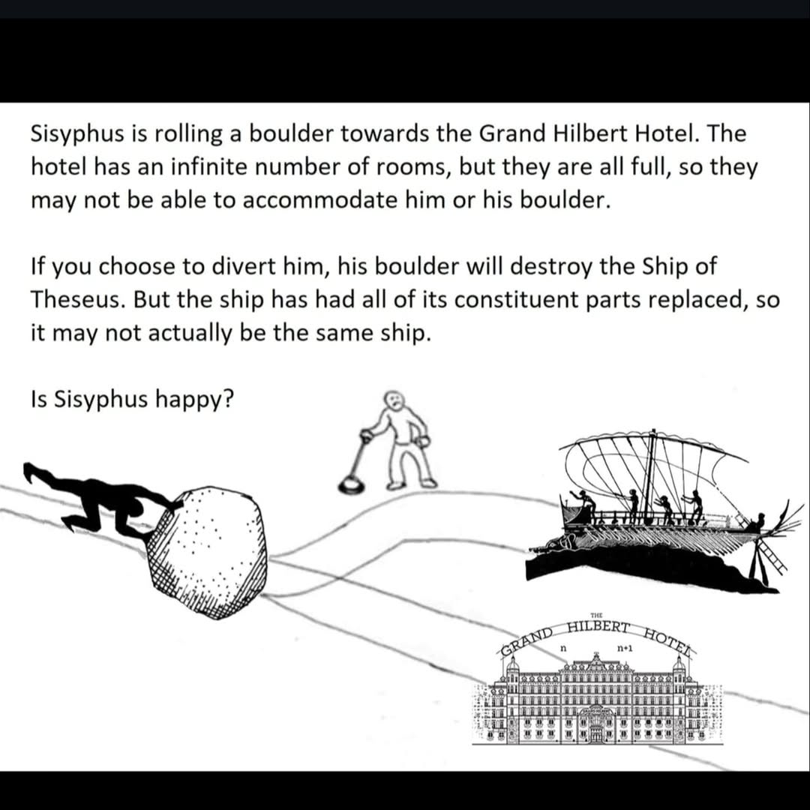

## Tech Memes

Some assorted memes that I think are very funny. Not restricted to only technology, actually.
The [portuguese](/pt-br/posts/tech-memes/) version of this post has more memes as well!

### Programming

>

>

>

>

>

>

>

>

>

>

>

>

>**JAVA.EXE**


>**Angry programmer yells at github pull request**


>*For data hoarders like me*
>

### Business

>

>

>

### STEM

>

>

>

### Philosophy

>
