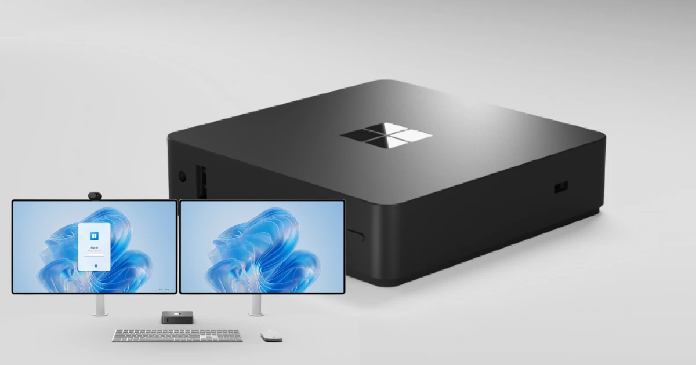
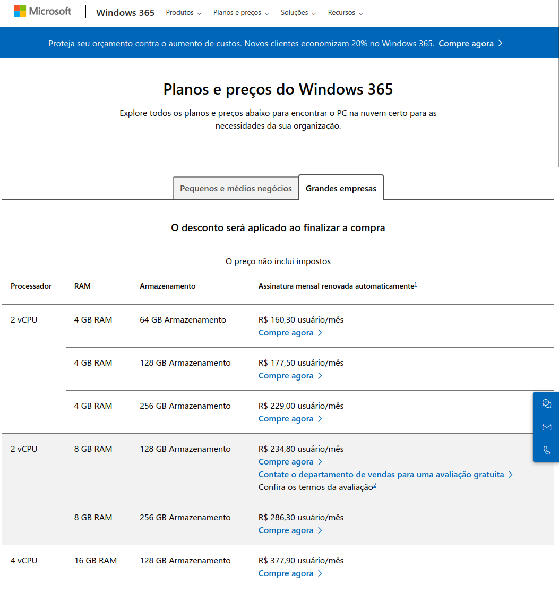
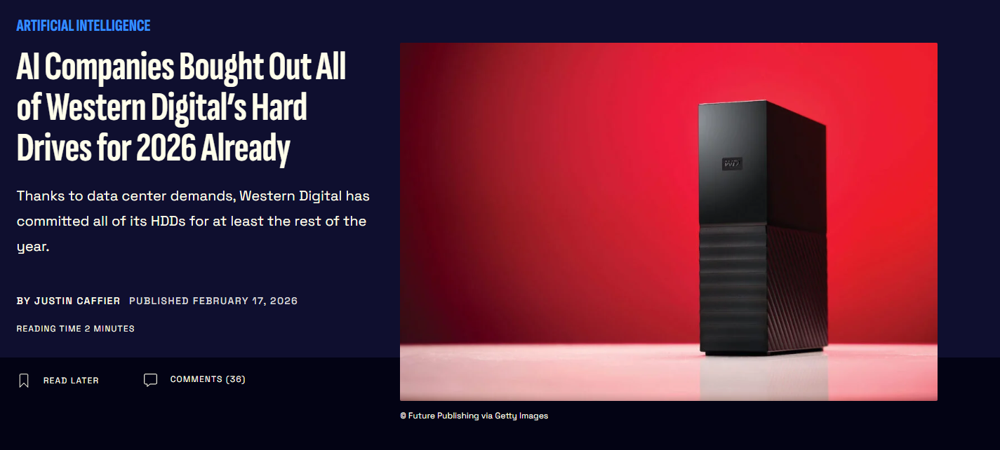
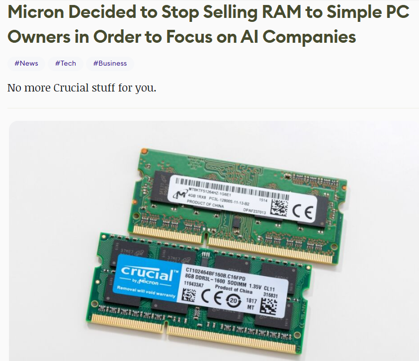
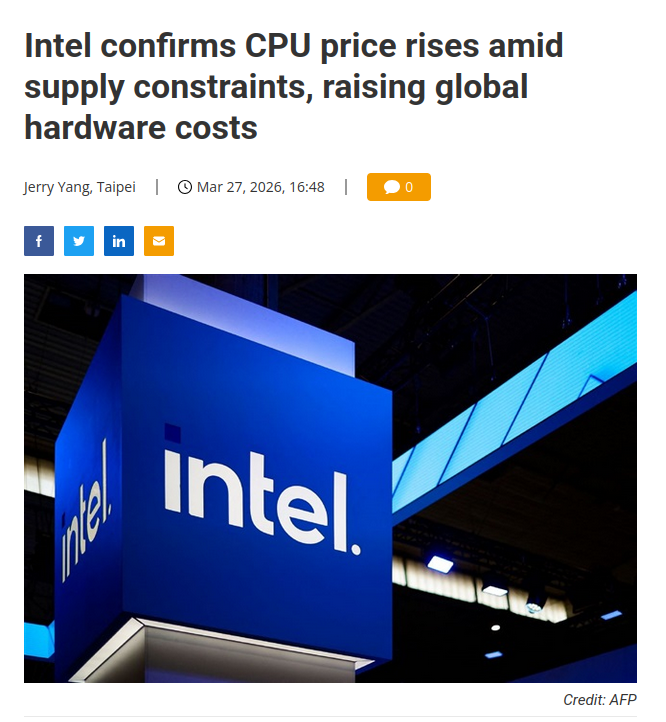

>
>The Real Reason Windows Hate Is Exploding: It's Not Just the UI—It's the End of Personal Computing - by Rob Braxman Tech

I was watching the video above and it occurred to me: home computing as we know it today may be seriously threatened.

# Microsoft and Thin Clients

First of all, let's talk about a little-known device. In 2025, the `Microsoft 365 Link` was launched. It's a portable _thin client_, that is, a low-cost machine whose sole focus is to run cloud applications, mimicking the operation of a personal computer. In practice, streaming is done from a remote computer to the device, which is then enabled to access its applications. It does not store data locally; everything is done from its own personal cloud.

Today, this device is only available to businesses; however, its billing model is quite peculiar: it depends on a virtual computing **subscription** called Windows 365 to be used. If the user needs to work with the Office suite, they will have to pay for another subscription.

All of this opens a major precedent for what the company can do in the future. Due to the concept of **_enshittification_**, the ultimate fate of publicly traded companies like Microsoft, we can see a movement towards predatory strategies to maintain high profit margins in order to please shareholders. And this could inevitably push the industry towards an **OSaaS** scenario, that's right, `Operating System as a Service`, even for regular desktops.

# AI-Powered Operating Systems

Returning to the merits of the video, the path Windows is taking is clear: an _AI-first_ system. The `Windows Recall`, however poorly received it initially was, is a prelude to what awaits us in the future: operating systems simplified to a mere restrictive interface based on prompts. Imagine, just you and a text box:

- **Want to watch a movie?** The AI ​​will automatically integrate with your streaming service, bringing you a list of options; you won't even need to enter a website or application.
- **Want to send an email?** Just say aloud what you want, and the text generators will take care of the "heavy lifting" of stringing words together, sending the result to the correct recipient.
- **Want to see photos from a trip you took?** Leave it to AI. It will search OneDrive for all photos cataloged with your search terms, using classification models (_powered by AI™_) that identify people, objects, and the overall context of the image. All of this in your own "private" cloud, easily indexable by a remote agent with dubious security.

And this, in a way, is great, as it will greatly reduce the technical barrier to using a personal computer. However, I strongly fear the **imbecilization of the average user**, who will find themselves facing a veritable oracle constantly serving them information. I have heard university professors arguing that even navigating directories, the basis of interaction with a system's files, will become obsolete with AI automation.

If this is the case, can we even call the user a... user? If the role of creating their own information (files, folder hierarchy, text writing, etc.) is outsourced, the individual becomes a mere **consumer** of information, generated specifically for them by the black box of intellectual infantilization. Thinking is no longer necessary; thinking will become a burden. All in the name of practicality.

# AI's Vicious Cycle

Now, let's analyze the current outlook. I've gathered some illustrative news:

>
>Fonte: [Gizmodo](https://gizmodo.com/because-of-ai-western-digital-hard-drives-are-sold-out-2000722591)

>
>Fonte: [80.lv](https://80.lv/articles/micron-decided-to-stop-selling-ram-to-simple-pc-owners-in-order-to-focus-on-ai-companies)

>
>Fonte: [DigiTimes Asia](https://www.digitimes.com/news/a20260326PD237/intel-cpu-price-hardware-oem.html)

We are in a context of high demand for hardware to fuel the artificial intelligence industry. Training AI models, creating data centers, and increasing cloud infrastructure are all necessary to support growing demand. According to the laws of economics, increased demand causes prices to rise, a fact already reflected in marketplaces and retail in general this year.

Given these restrictive prices, it will become increasingly attractive for the average user to acquire **more cost-effective** options. And who fits this equation better than _thin clients_? They will naturally be much cheaper than average, after all, all the heavy processing will be delegated to the cloud, freeing the user from the need to own a powerful machine. These devices will become competitive by nature.

From a **cultural perspective**, we have a growing number of young people who are unfamiliar with desktops, instead possessing expertise limited to smartphones, devices that are similar to _thin clients_ in certain aspects. In parallel, we have the rise of generations alpha and beta, individuals already immersed in the context of the internet and artificial intelligence. There will be a shift of new desktop users towards AI-powered _thin clients_; these new users will not even miss traditional desktops because they have had little or no contact with them.

A `feedback loop` will then occur:
- more and more AI-powered solutions
- demand from AI companies for hardware rises
- price of parts increases
- users will be forced to purchase _thin clients_ to act as desktops
- domestic demand for parts decreases
- manufacturers increasingly turn to AI companies, allocating resources to the production of dedicated hardware
- the domestic market becomes more expensive due to lack of supply

In the end, building your own PC will become **unfeasible**. Conclusion: **stock up on PC parts**.

# Counterpoints

I launched these ideas in an online community and received some feedback. I will respond to them here to enrich the discussion.

>[...] But I don't think it will be that apocalyptic: Local AIs are a growing trend, as is the adoption of local clouds (on-premise) and software and services – for local use or private hosting – alternatives to those from MS, Apple, etc.; so, hardware manufacturers will certainly adapt to meet (and profit from) all these demands as well.

It would make sense if we still lived in the world of _bare-metal_ servers where each company maintained its own physical infrastructure within its premises. Today everything is based on cost reduction; in this respect, the cloud is unbeatable, nobody wants the burden of performing maintenance. Regarding the adaptation of demand, this would be an adaptation for server parts, not parts for home use, as we are discussing.

>I think you're wrong to ignore the fact that the parts used by data centers age and are replaced, flooding the second-hand market.
>I also think you overestimate a Microsoft experiment on a concept that has failed before.
>I don't think the scenario is as dangerous as you predict. Sure, it might change the dynamics of office computing with simple use cases for computers, but that certainly won't happen in environments where a computer needs more than just access to Windows and Office 365.

Regarding parts, the second-hand market isn't enough. Everything that is replaced will have been used intensively and uninterruptedly for at least five years, greatly increasing the **risk of failure** and reduced operational capacity.

I must agree that this is very pessimistic on my part, and indeed the first steps would be taken by those who only use basic things, like the Office suite. However, I fear that this will gradually take over the industry with the same motivation as the migration of local servers to the cloud: cost reduction. Why invest in an expensive video editing or 3D modeling machine when everything can be offloaded to a remote server? Physical risks such as equipment damage, malfunctions, repairs, and expensive replacement parts will be virtually eliminated, giving more **predictability to a company's IT processes**.

>Have you ever noticed how modern computers are? Exactly like cell phones and tablets.
>The hard drive is soldered to the motherboard, so you can't easily replace it or remove it if you want, and the same goes for the RAM. Any basic problem that you could solve yourself is gone, even local technical support is practically unable to do anything quickly; everything requires a microscope and someone very good at soldering and electronics to be careful and not mess everything up.

>Besides that, Windows 11, for your "security," encrypts the entire hard drive and keeps the keys stored on their server for your "comfort."
>The BIOS/SETUP and such still allow many things to run on the old/legacy motherboard, but I wouldn't be surprised if in 10-20 years it will only be possible to buy motherboards where only certain systems can be installed or, in the best-case scenario, it will be much more complex and difficult to install a Linux distro.

These are great points I hadn't thought about. In fact, modern laptops are abandoning one of the greatest aspects of computer architecture, modularity, restricting the end user's power of choice and freedom of use. Regarding the potential rigidity that could be introduced in the BIOS, this worries me, even more so with the mandatory use of TPM in Windows 11. It's another good reason to be cautious and have some spare parts.
