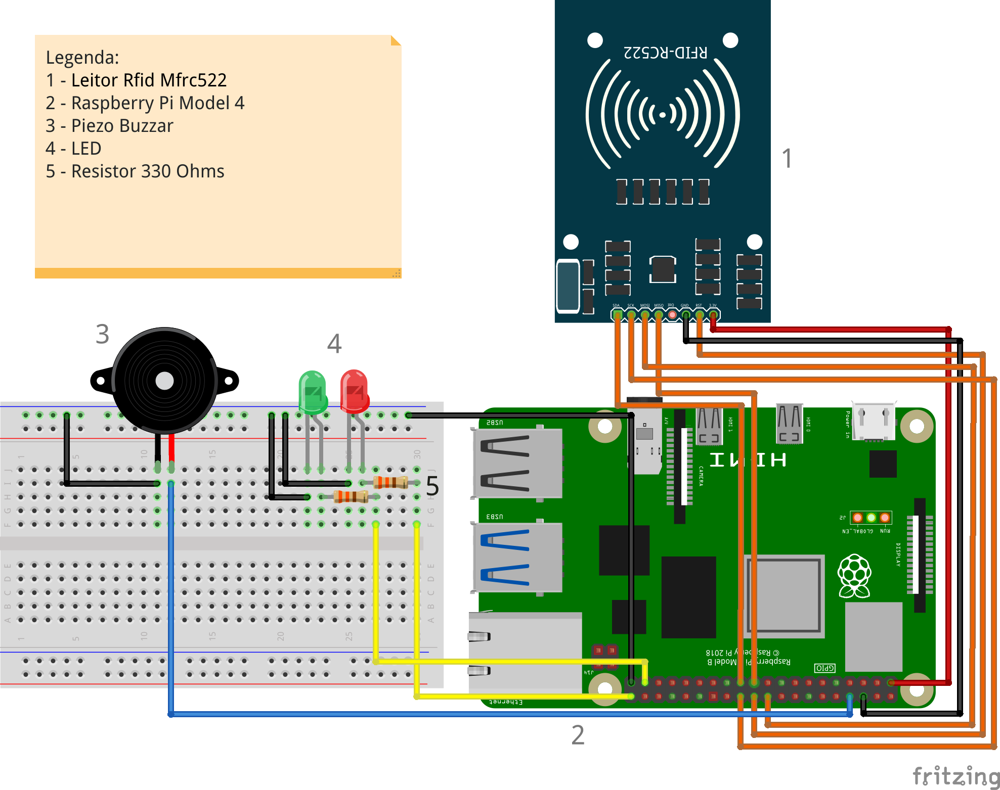

## ⚙️ Sistemas
### ⛓️ Blockchain Logger
Um `microserviço` executado em um container `Docker` que utiliza uma rede Blockchain para salvar dados de log. Criado em `Python` e Flask, atua como o logger de uma API, criando registros a cada ação tomada pelo usuário, gerando retratabilidade e auxiliando processos de auditoria.

Acessos na API externa disparam uma chamada a um endpoint do Logger, que formata a informação e a salva na Blockchain `Ethereum`, garantindo confiabilidade nos dados salvos. Para isso, foram implementados **Smart Contracts** na linguagem Solidity, responsável por executar a lógica para salvar os dados na rede. Testes automatizados usando a biblioteca PyTest são capazes de atestar o funcionamento da aplicação.

Demonstração:




## 📡 IOT
### 🔥 EMBER
Um sistema de controle de acesso escrito em Python que fiz como proposta de projeto final do meu curso de Sistemas de Informação. Usa um `Raspberry Pi` para atuar como mediador para permitir ou negar acesso a recursos computacionais por meio de um leitor e cartões `RFID`.

EMBER significa **E**ntrada **M**ediada por **B**lockchain, **E**thereum e **R**aspberry. Infelizmente a proposta do projeto não foi aprovada, então o código não contempla o aspecto Blockchain do projeto. No entanto, o sistema de controle de acesso está totalmente funcional.

Demonstração:




### 💡 Arduino Game
Fiz a implementação do jogo Simon Says usando um `Arduino`. Uma estrutura de dados própria gerencia o estado do jogo, como a quantidade de acertos consecutivos.

Demonstração:


Utilizando um piezzo buzzer, implementei uma música de vitória para o caso do jogador conseguir alcançar uma quantidade *N* de acertos.

Demonstração:




## 📜 Legacy code
Estes são alguns códigos que criei durante meus anos de aprendizado na faculdade. Os chamo de legado pois, atualmente, observo que eles não possuem a qualidade que eu preso nos dias de hoje. Mas mesmo assim não deixam de ser aplicações interessantes.

Projetos diversos de criação de aplicativos para celular utilizando a linguagem Dart e o framework Flutter:



Códigos sortidos. O principal são os diversos códigos que fiz em C++, desde estruturas de dados (Grafos, Árvores, Listas Encadeadas) até algoritmos de ordenação e string matching.



API para gerar nomes aleatórios, tanto em português quanto em inglês. Pretendo dar uma atualizada no futuro.



## 👨‍💻 Em desenvolvimento

Projeto com:
- React
- CI/CD & Github Actions

Projeto com:
- NestJS & Clean Architecture
- TDD & DDD
- CI/CD
- Cloud
